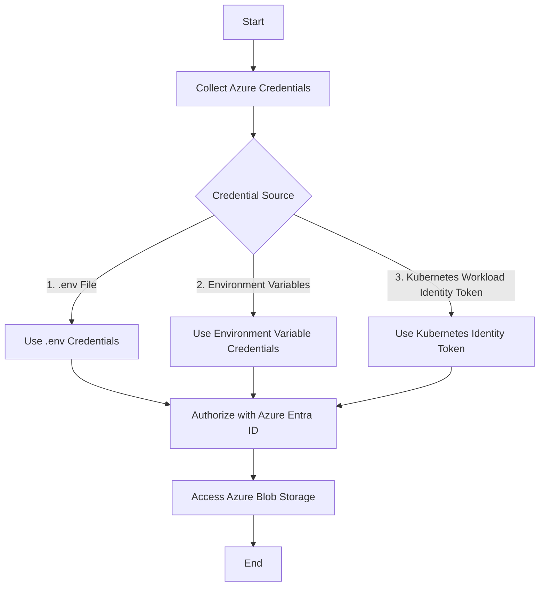

# Simple Blob Storage Consumer

A simple API-based app which identifies itself through Azure Entra ID and consumes Azure Blob Storage. A Swagger application is also included as the API documentation - accessible through `http://localhost:8080/swagger/index.html`

## Architecture




### Explanation:
- **Start**: The beginning of the process.
- **Collect Azure Credentials**: The app tries to collect Azure credentials.
- **Credential Source**: A decision node to determine the source of the credentials.
  - **.env File**: The app first looks for credentials in the .env file (good for development).
  - **Environment Variables**: If not found, it checks for credentials in environment variables.
  - **Kubernetes Workload Identity Token**: Finally, it tries to use Kubernetes Workload Identity Token if other methods are not available.
- **Authorize with Azure Entra ID**: The app uses the collected credentials to authorize itself with Azure Entra ID.
- **Access Azure Blob Storage**: Once authorized, the app accesses Azure Blob Storage.
- **End**: The end of the process.

To render this diagram, you'll need a Markdown editor or viewer that supports Mermaid diagrams. Some popular choices include GitHub, GitLab, and various Markdown editors with Mermaid support.

## Getting started

This project requires Go and Swag to be installed.

Copy the content of `.env.example` to `.env` and reflect the development configuration. Then run it using:

```bash
go get .
go run main.go
```

When your contribution is done, run the following command to generate the docs:
```bash
swag init
```


## TODO
- [ ] Move `swag init` to CI
- [ ] Move commands to a `Makefile`
